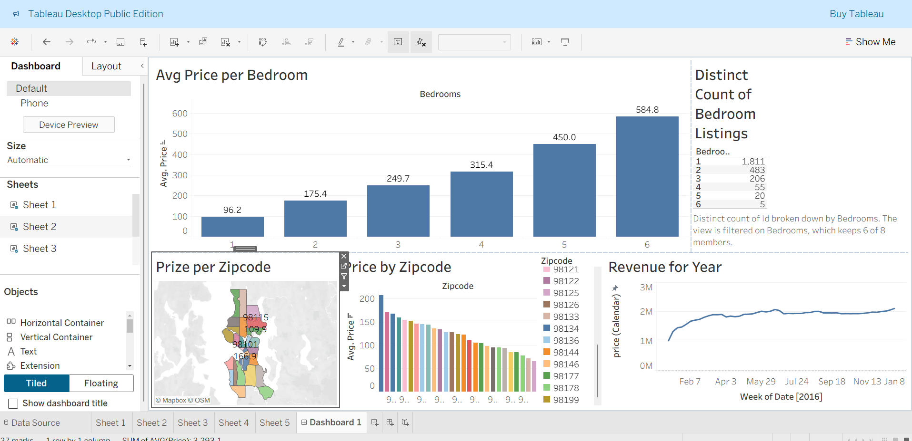

# 🏠 Tableau Project: Airbnb Listings 2016 Analysis

This repository contains a data visualization project built using **Tableau Public**. The analysis explores Airbnb listings from the year 2016 to understand how factors such as bedroom count, location, and time affect prices and revenue.

---

## 📂 Repository Contents
- **Tableau Full Project.twbx** → Tableau workbook containing dashboards and visualizations.  
- **Tableau Full Project.xlsx** → Dataset used for analysis (Airbnb Listings 2016) *(Not uploaded due to large file size)*/ https://www.kaggle.com/datasets/alexanderfreberg/airbnb-listings-2016-dataset.  
- **airbnb-tableau-dashboard.png** → Folder containing dashboard preview images.  
- **README.md** → Documentation describing the project, insights, and usage instructions.
---

## 📑 Dataset Description
The dataset represents **public Airbnb listings data from 2016**, including details such as:
- **Listing features** — number of bedrooms, price, and location (zipcode).  
- **Host and property details** — property type, room type, etc.  
- **Revenue and booking data** — total revenue across weeks in 2016.  

The dataset is suitable for analyzing **pricing trends**, **location-based insights**, and **revenue growth patterns**.

---

## 📊 Dashboard Overview

The Tableau dashboard visualizes several key insights:

1. **Average Price per Bedroom**  
   - Shows how the average price increases with the number of bedrooms.

2. **Distinct Count of Bedroom Listings**  
   - Displays the number of listings for each bedroom category.

3. **Price per Zipcode (Map + Bar Chart)**  
   - Highlights geographic variation in prices across different zipcodes.

4. **Revenue for the Year**  
   - Illustrates the revenue trend throughout 2016.

---

## 🔎 Key Insights

- **Larger properties** with more bedrooms generally have **higher average prices**.  
- **Most listings** consist of **1–2 bedroom properties**, making them the most common options on Airbnb.  
- **Zipcode-based pricing** shows that certain areas command significantly higher prices than others.  
- **Revenue trend** remained relatively stable over 2016, with slight fluctuations across weeks.  

---

## 📈 Conclusion
The Airbnb 2016 data shows clear relationships between property size, location, and pricing.  
Larger listings tend to generate higher prices, while popular zipcodes exhibit premium rates.  
Using Tableau’s interactive features, users can explore these insights dynamically for deeper understanding.

---

## 📷 Dashboard Preview

